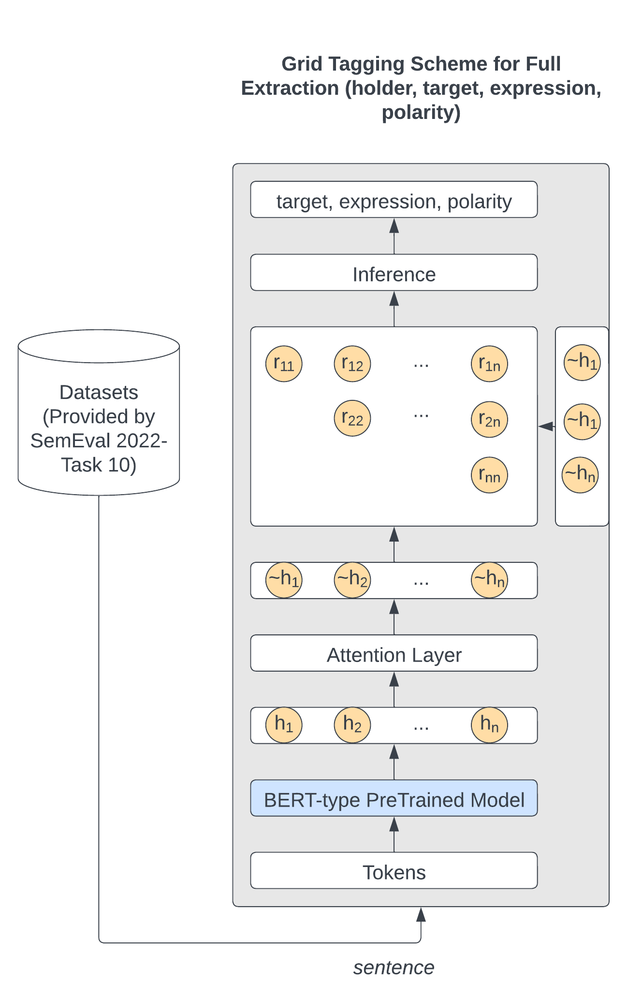

# Gridlocked Opinions: A Tagging Scheme Unraveling Targets, Holders, Expressions, and Polarities

This repo our all-in-one Grid Tagging Scheme model inspired by the ISCAS participation in [Task 10](https://github.com/jerbarnes/semeval22_structured_sentiment/): "Structured Sentiment Analysis" in [SemEval 2022](https://semeval.github.io/SemEval2022/).

## Abstract

Our team revisited the results from the SemEval-2022 Task 10: Structured Sentiment Analysis. 
We leveraged a Grid Tagging Scheme (GTS) which extracted target, holder, expression, and polarity.
We adapted a pre-existing pipeline solution, which consisted of several
steps to extract information and transformed into a single-step model that extracts all aspects of the sentiment. 
The proposed model demonstrated compelling performance when compared against the more complex and resource intensive model it was initially based on.

## Results

### Monolingual

|                |  SF1  |  SP   |  SR   |
| :------------: | :---: | :---: | :---: |
|   opener_en    | 0.66  | 0.68  | 0.64  |
|   opener_en    | 0.61  | 0.71  | 0.54  |

## System Overview



## Setup

### Model preparation

Prepare all the backbones this repo depends on through executing the following script:

```
bash ./all_in_one.sh
```


### Extraction

Train the GTS-based Extraction subsystem:

```bash
# Monolingual training
bash ./scripts/train_GTS_*.sh $gpu_num # train individual models

```

The trained models and evaluation outputs will be saved at ```./src/GTS/saved_models/extract/```

Predict:

```bash
bash ./scripts/predict_GTS.sh $gpu_num # Co-extraction subsystem predict
```


## Acknowledgements

We would like to thank the ISCAS team for providing an excellent repository which served as a foundation for our study.
